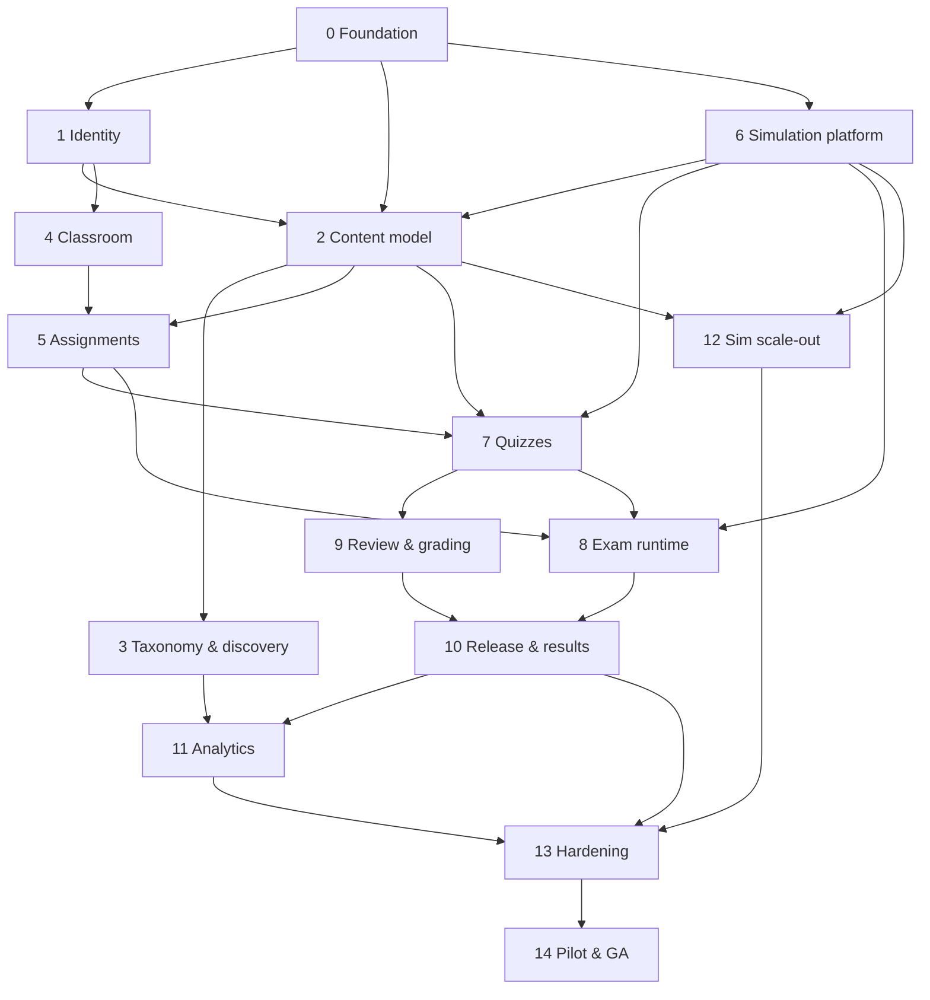

# Orrery — End-to-End Implementation Plan

> **Status:** authoritative build plan. Executed by agents. See `docs/EXECUTION-PROTOCOL.md` for *how* to execute.
> **Product:** a registration-open educational portal where anyone authors resources, quizzes and exams, embeds hundreds of simulations, runs classrooms, and grades submitted work.

---

## 1. What we are building

Orrery is a multi-tenant learning platform with four coupled products:

| # | Product | Core promise |
|---|---|---|
| 1 | **Studio** — content authoring | Anyone registers and authors resources: lessons, quizzes, exams. Structured block editor, math typesetting, embedded simulations. |
| 2 | **Simulations** | A sandboxed, versioned catalogue of 200+ interactive simulations across maths, physics, chemistry, biology, technology and more. Embeddable in resources *and* gradable as exam questions. |
| 3 | **Classroom** | Teachers own classrooms, invite students, assign resource versions. |
| 4 | **Assessment & Grading** | Quizzes auto-grade. Exams run under configurable integrity conditions (fullscreen, pointer lock, per-question and total time limits, availability windows). **Every** response is submitted to the teacher for review; automatically-graded items are **withheld** until the teacher releases the whole batch. |

### 1.1 The three rules that shape the architecture

1. **Server is the only authority.** Client clocks, client scores, and client-side state are untrusted. Deadlines, grading and release are computed server-side. The exam client is a *renderer of server truth*, not a source of it.
2. **Content is immutable once assigned.** A `ResourceVersion` is snapshotted; an `Assignment` pins a specific version. Editing a resource after assignment never changes what a student is assessed on.
3. **Withholding is atomic.** A student never sees a partially-graded result. Auto-grades are computed at submission but held in a sealed field until a `ReleaseBatch` is released by the teacher.

---

## 2. Scope

### v1 (must ship)
- Email/password + magic-link auth, email verification, sessions, account deletion/export.
- Subjects taxonomy (hierarchical), tags, resource library, search, visibility (private / unlisted / public).
- Block editor: text, headings, lists, images, callouts, tables, code, KaTeX equations, video, **simulation embed**, **inline practice check**.
- Resource lifecycle: draft → published → archived, with versioning + diff.
- Classroom: create, rename, archive, memberships (owner/teacher/student), invitations by email or join code, roster CSV import, role changes, removal.
- Assignments: pin resource version, availability window, per-assignment overrides.
- Question types: single-choice, multi-select, true/false, numeric (tolerance/precision), short text, free response (manual), file submission (manual), **simulation response (auto-gradable via server-side adapter)**.
- Quiz runtime: attempt limits, optional shuffle, per-question feedback, autosave, manual-review queue.
- Exam runtime: integrity policy engine (fullscreen, pointer lock, window focus, copy/paste, per-question time, total time, window availability, attempt count, accommodations mode), server-authoritative deadlines, autosave outbox, idempotent submit, tamper-evident submission receipt.
- Grading: review queue, per-question manual grading, rubrics, comments, bulk actions, regrade, release batches, per-question and per-item feedback to students.
- Gradebook: per-assignment and per-student views, weighted totals, export CSV, missing/late flags.
- Simulation platform: SDK, sandboxed host, JSON manifests, registry, conformance test suite, 24 "gold standard" sims, catalogue page.
- Accessibility WCAG 2.2 AA for authoring and exam surfaces; accommodations mode.
- Audit log, structured logs, error tracking, metrics, backups.

### Deferred (explicitly out of v1, with a note where it will land)
| Deferred | Rationale | Lands in |
|---|---|---|
| Live tutoring / video calls | Not core to assessment | post-v1 |
| Payments / subscriptions | No requirement stated | post-v1 |
| Custom domain per classroom | Cosmetic | post-v1 |
| Native mobile apps | Exam conditions need a browser | never (responsive web only) |
| Offline exam taking | Conflicts with server-authoritative timing | v2 with local-first queue + reconciliation |
| Webcam/photo proctoring | Privacy, consent and legal review required | v2, opt-in, per-classroom |
| AI question generation | Adjacent, needs eval harness | v2 |
| Full-text search (Postgres FTS first) | Adequate at v1 scale | v2 → Typesense |
| Plagiarism auto-flagging | Similarity signals only, no accusation | v2 (v1 exposes data for teacher judgement) |

---

## 3. Stack

Chosen for agentic execution: strongly typed end-to-end, declarative schema, few novel tools, easy local reproduction, everything in one language.

| Layer | Choice | Rejected alternative | Why |
|---|---|---|---|
| Language | TypeScript 5.9, `strict`, Node 24 | Python/Django, Go | One language, one toolchain, shared types across sims and app |
| Monorepo | pnpm workspaces + Turborepo | Nx | Minimal config surface, deterministic, cached task graph |
| Web | Next.js 15 App Router, React 19, RSC | Remix, Vite SPA + separate API | SSR for public library, first-class client components for exam runtime, one deployable |
| API | tRPC v11 for app surface; **versioned REST for exam-critical paths**; Inngest event bus | REST-only, GraphQL | tRPC = end-to-end types for agents; REST = retry/idempotency/beacon-friendly for autosave & telemetry |
| DB | PostgreSQL 16 | MySQL, SQLite | Strong constraints, JSONB, `tstzrange`, CTEs, row-level security, LISTEN/NOTIFY |
| ORM | Prisma 6 + targeted raw SQL for analytics | Drizzle | Declarative schema + checked-in migrations is the lowest-risk surface for autonomous agents |
| Auth | Better Auth (sessions in Postgres) | Auth.js, Clerk | No vendor lock, DB sessions so we can revoke mid-exam, org/role primitives |
| UI | Tailwind CSS 4 + shadcn/ui | CSS Modules, Mantine | Copy-in components, tokens, theming, dark mode |
| Validation | Zod v4 in `@orrery/contracts` | ad-hoc | One discriminated-union definition of every question type, used by client + server + sims |
| Editor | TipTap v3, ProseMirror JSON is the canonical block format | MDX, Lexical | Structured, sanitising, no arbitrary JSX execution from user content |
| Math | KaTeX | MathJax | Fast, sync, SSR-safe |
| Simulations | esbuild ESM bundles in a `sandbox="allow-scripts"` iframe, `postMessage` RPC `sim-host@1`, dual browser/grader export | Web Components, WASM-only, React components | Opaque isolation; server- and browser-runnable grading logic; no dependency on the host app |
| Jobs | Inngest (durable steps) + Postgres cron | BullMQ, Temporal | Low ops, typed events, retries and step history for grading/audit |
| Storage | S3-compatible (MinIO locally, S3/R2 in prod), presigned PUT | Disk | Horizontal, no server disk state |
| Email | Resend | SES, Postmark | Simple API, good deliverability defaults |
| Cache / rate limit | Redis (self-hosted in dev) | in-process | Correct rate limits across replicas |
| Tests | Vitest, Playwright, Testcontainers | Jest | Fast, TS-native, single toolchain; Playwright drives both E2E and sim conformance |
| Observability | OpenTelemetry → Sentry + Grafana, Pino JSON logs | — | Correlates exam sessions end to end |
| CI | GitHub Actions | — | Native to the git worktree protocol |
| Deploy | OCI containers + managed Postgres + Redis + S3 | Vercel-only | Container build pipeline is part of the sim registry; workers need long-lived processes |

### 3.1 Scale assumptions used for sizing
- Registered users: 50,000. Peak concurrent web: 1,000. **Peak concurrent exam takers: 750.**
- Resources: 20,000. Simulations: 200+ registered, 25,000 student-invocations/day.
- Exam write load: one student produces ~1 write per 5 s (autosave) → 750 × 0.2 = 150 writes/s steady, 400/s at a deadline stampede. Mitigations: jittered autosave, deadline-bucketed write shedding, pre-deadline forced submit.
- Single exam assignment may reach 5,000 submissions released in one batch → release must be a batched background job, never a synchronous fan-out.

---

## 4. Repository layout

```
orrery/
├─ apps/
│  ├─ web/                     # Next.js: marketing, studio, classroom, exam runtime, grading
│  └─ worker/                  # Inngest worker + cron (auto-submit, releases, digests, emails)
├─ packages/
│  ├─ contracts/               # Zod schemas: blocks, questions, policies, sim manifests, API DTOs
│  ├─ db/                      # Prisma schema, migrations, seed, raw-SQL query modules
│  ├─ sim-sdk/                 # author-facing SDK: types, host bridge, graders, test harness
│  ├─ sim-host/                # iframe runtime that loads and drives simulations
│  ├─ grading/                 # pure grading engine (auto-grade, similarity, rubrics)
│  ├─ exam-engine/             # policy evaluation, deadline math, violation rules (isomorphic, unit-testable)
│  ├─ auth/                    # Better Auth server + session helpers, RBAC guards
│  ├─ ui/                      # design system, block renderers, editor extensions
│  └─ config/                  # eslint, prettier, tsconfig bases, env schema
├─ sims/                       # one folder per simulation: src/, sim.manifest.json, sim.spec.md, LICENSE
│  ├─ _template/               # scaffolded starting point; `pnpm sim:new` copies it
│  └─ <subject>.<slug>/        # e.g. maths.projectile-motion/
├─ docs/                       # this plan + topic deep dives + ADRs
├─ tasks/                      # per-task agent packets generated at execution time
├─ scripts/                    # sim:new, sim:validate, seed, perf, chaos
├─ e2e/                        # Playwright specs (app flows + sim conformance matrix)
└─ infra/                      # compose, dockerfiles, terraform, migrations runner
```

**Rule:** app code never imports from `sims/`. Simulations only ever see `sim-host@1` and `@orrery/sim-sdk`.

---

## 5. Engineering standards

### 5.1 Quality gates — every task must pass all five before review
```
pnpm lint         # eslint + prettier check
pnpm typecheck    # tsc --noEmit across all packages
pnpm test         # vitest, unit + integration (Testcontainers for PG/Redis)
pnpm test:e2e     # playwright, against a seeded local stack
pnpm audit:deps   # osv-scanner, fails on high/critical
```
Plus per-domain gates: `pnpm sim:validate` (P6+), `pnpm a11y` (axe over key surfaces, P2+), `pnpm i18n:check` (no hardcoded strings, P13).

### 5.2 Conventions
- Branches: `phase/<NN>-<slug>/<task-id>-<slug>`, e.g. `phase/08-exam-runtime/P8-T4-fullscreen-watchdog`.
- Commits: Conventional Commits, one logical change. Task completion is signalled by `Task: P8-T4` trailer so the phase board can be updated automatically.
- IDs: `cuit2`-free — use `crypto.randomUUID()` v7 ordering via `@orrery/ids` (a `ulid`-compatible helper). Never reuse an ID from a deleted row in a reference field; soft-delete user content.
- No barrel files across packages. No `any`. `unknown` + narrowing at boundaries.
- All time handling goes through `@orrery/clock`: `Clock` interface, `SystemClock`, `FrozenClock` for tests. **No bare `Date.now()` in application code** — this makes the whole time model testable, which the exam phase depends on.
- All randomness through `@orrery/rng` (seedable PRNG) so per-student question variants are reproducible from a stored seed.
- Migrations: one logical change per migration, forward-only, with a tested down path for local dev. No destructive migration without a `MIGRATION.md` note and a pre-flight data copy step.

### 5.3 Test targets
| Layer | Target | Notes |
|---|---|---|
| Unit | ≥ 85% lines on `contracts`, `grading`, `exam-engine` | These are the money packages; aim 100% branch coverage on grading and exam-engine |
| Integration | Every tRPC router + every REST endpoint | Real PG/Redis via Testcontainers |
| Contract | Sim conformance matrix | Every registered sim, run in Chromium, asserted handshake + deterministic grade |
| E2E | 12 golden paths (below) | The gate for milestone sign-off |
| Property-based | deadline math, shuffle, grading, policy transitions | `fast-check`; catches the off-by-one that E2E misses |

**Golden E2E paths:** register → author resource with sim embed → publish → create classroom → invite student → student joins by code → teacher assigns pinned version → student takes quiz → auto-grade held → teacher reviews + releases → student sees result → teacher exports gradebook. Plus: full exam happy path; exam violation path; exam deadline expiry; offline autosave recovery; accommodations mode; regrade propagation.

---

## 6. Phase graph



**Critical path:** `P0 → P1 → P2 → P6 → P8 → P9 → P10 → P13 → P14`. Simulation platform sits on the critical path, which is why P6 is early and gets the largest early investment.

### 6.1 Phase index

| Phase | Name | Size | Ideal agent-hrs | Depends on | Gate (demo) |
|---|---|---|---|---|---|
| P0 | Foundation & decisions | M | 20 | — | `pnpm dev` boots web+worker+PG+Redis, CI green, ADRs accepted |
| P1 | Identity & accounts | M | 24 | P0 | Register, verify, log in, out, delete account |
| P2 | Content model & editor | L | 60 | P0,P1 | Author a resource with every block type, save, version, publish |
| P3 | Taxonomy, library & discovery | M | 28 | P2 | Browse, search, filter, publish/unpublish a resource |
| P4 | Classrooms, membership & invites | L | 44 | P1 | Teacher invites by email and by code; student joins; roles enforced |
| P5 | Assignments & version pinning | M | 28 | P2,P4 | Assign v1, edit to v2, student still sees v1 |
| P6 | Simulation platform + 24 gold sims | XL | 88 | P0 | Sim loads sandboxed, emits grade, passes conformance suite |
| P7 | Quiz runtime & auto-grading | L | 68 | P2,P5,P6 | Full quiz loop with autosave and held auto-grades |
| P8 | Exam runtime & integrity | XL | 104 | P5,P6,P7 | Exam under full policy, deadline enforced server-side, violations logged |
| P9 | Teacher review & grading | L | 60 | P7 | Review queue, manual grading, bulk actions, regrade |
| P10 | Release & results | M | 44 | P8,P9 | Atomic release; students see nothing before it |
| P11 | Analytics & reporting | L | 52 | P3,P10 | Gradebook, item analysis, integrity report, CSV export |
| P12 | Simulation scale-out to 200+ | XL | 130 (parallel) | P6,P2 | Registry at 200+ with 100% conformance pass |
| P13 | Hardening, a11y, i18n, perf, DR | L | 72 | P10,P12 | Load test at target, WCAG AA audit passed, restore drill done |
| P14 | Pilot, seed content & GA | L | 60 | P13 | Pilot classroom of 30 completes an exam end to end |
| | **Total** | | **~884** | | |

With 4–6 parallel agent lanes, ~2 weeks of uninterrupted critical path plus integration overhead: **6–9 weeks wall clock** to GA. P12 is embarrassingly parallel and is the main schedule shock absorber — it must start no later than P9.

---

## 7. Phases

Each phase below is expanded into a packet in `tasks/` at execution time. The task table is the source of truth: **T-ids are stable and referenced by commits, reviews and the board.**

---

### P0 — Foundation & decisions · M · 20h

**Goal:** a repository where an agent can run one command and get a working, tested, observable stack, and where every load-bearing decision is written down.

| ID | Task | Deps | Size |
|---|---|---|---|
| P0-T1 | Monorepo scaffold: pnpm workspaces, Turborepo pipeline, tsconfig bases, `packages/*` empty packages with correct exports | — | S |
| P0-T2 | Tooling: ESLint flat config + import-boundary rules, Prettier, Vitest + Playwright projects, Husky + lint-staged | P0-T1 | S |
| P0-T3 | Local infra: `docker compose` (PG 16, Redis, MinIO, Mailpit), `.env.example`, `env.ts` Zod-validated environment with build-time failure | P0-T1 | S |
| P0-T4 | `@orrery/db`: Prisma schema v0 (identity only), migration pipeline, seed script, Testcontainers fixture | P0-T3 | M |
| P0-T5 | Next.js app skeleton with route groups, error boundaries, Sentry init, Pino logger, health/readiness endpoints | P0-T2 | M |
| P0-T6 | `@orrery/clock`, `@orrery/ids`, `@orrery/rng` primitives with unit tests (these are load-bearing for P8) | P0-T1 | S |
| P0-T7 | CI workflow: install → generate → lint → typecheck → unit+integration → build → e2e (compose service containers) | P0-T5 | M |
| P0-T8 | ADR set 0001–0014 written and accepted; `docs/adr/README.md` index | P0-T1 | M |
| P0-T9 | Observability skeleton: OTel SDK in web + worker, structured request logging with `x-request-id`, metrics endpoint, Grafana dashboard JSON | P0-T5 | M |

**Exit criteria**
- `pnpm setup && pnpm dev` yields: web on :3000, worker running, PG/Redis/MinIO/Mailpit healthy, `/healthz` and `/readyz` green.
- `pnpm lint && pnpm typecheck && pnpm test && pnpm build` all pass from a clean clone.
- Every ADR has Status/Context/Decision/Consequences, and at least one rejected alternative is recorded per decision.
- `@orrery/clock` is proven testable: a test freezes time and asserts expiry logic.

**Risks:** none material. This phase exists to eliminate all of them.

---

### P1 — Identity & accounts · M · 24h

**Goal:** anyone can register and own things; sessions are revocable; accounts can be exported and deleted.

| ID | Task | Deps | Size |
|---|---|---|---|
| P1-T1 | Better Auth setup: email+password, magic link, verification, DB sessions, `User.status` (active/suspended/deleted) | P0-T4 | M |
| P1-T2 | Profile: display name, avatar (presigned upload), locale, timezone, notification prefs | P1-T1,P0-T3 | S |
| P1-T3 | Auth UI: sign in/up/verify/forgot/reset, resend verification, cooldown UX, rate limiting, generic error copy (no account enumeration) | P1-T1 | M |
| P1-T4 | Session middleware: route protection, redirect semantics, `getSession()` cache, organisation-agnostic | P1-T1 | M |
| P1-T5 | Account deletion: grace period, cascade plan for owned content, anonymisation of submissions, export-as-JSON job | P1-T1,P0-T9 | M |
| P1-T6 | Permissions kernel: `can(user, action, resource, context)` pure function + exhaustive test matrix, used by every later phase | P1-T1 | M |
| P1-T7 | Anti-abuse: signup throttles, disposable-email domain blocklist (configurable), suspicious-login audit events | P1-T1 | S |
| P1-T8 | Playwright auth fixtures: `user()`, `teacher()`, `student()` factories with deterministic identities | P1-T3 | S |

**Exit criteria:** register → verify → session; suspended user cannot log in; deleting an account anonymises authorship of existing submissions while grades are retained; `can()` has 100% branch coverage; no route leaks another user's data.

---

### P2 — Content model & editor · L · 60h

**Goal:** the canonical content representation, the editor, and the renderer — everything else (quizzes, exams, sims) renders through this.

| ID | Task | Deps | Size |
|---|---|---|---|
| P2-T1 | Block schema in `@orrery/contracts`: discriminated union of 14 block types with Zod validators, including `equation`, `callout`, `image`, `video`, `table`, `code`, `embedSimulation`, `practiceCheck` | P0-T6 | L |
| P2-T2 | Block renderer: server-render blocks to sanitised HTML, KaTeX SSR, lazy media, table/figure semantics | P2-T1 | M |
| P2-T3 | Editor shell: TipTap v3 with custom nodes for all 14 blocks, block-level drag/handle menu, slash command palette, keyboard-first | P2-T1 | XL |
| P2-T4 | Autosave & conflict handling: optimistic concurrency via `resourceVersion` counter, 409 with three-way merge offer (mine/yours/both) | P2-T3 | M |
| P2-T5 | Versioning: immutable `ResourceVersion` snapshots, version list, human-readable diff (block-level), restore-as-new-version | P2-T4 | M |
| P2-T6 | Media library: presigned uploads, image dimension/EXIF strip, alt-text enforcement, video embed via provider allowlist | P2-T1 | M |
| P2-T7 | Accessibility pass on editor + renderer: focus management, ARIA for block handles, KaTeX MathML output, contrast tokens | P2-T3 | M |
| P2-T8 | Draft/publish/archive state machine + visibility (private/unlisted/public) with a permission re-check on every read | P2-T5,P1-T6 | M |
| P2-T9 | Resource library UI: my resources, ownership transfer, duplicate, resource usage report ("used in 3 classrooms") | P2-T5 | S |

**Exit criteria:** author a document exercising all 14 block types including two simulation embeds and three equations; reload and confirm byte-identical render; create v1, edit, create v2, view diff, restore; a user cannot read a private resource they do not own even with a direct ID; axe scan clean on editor and read view.

---

### P3 — Taxonomy, library & discovery · M · 28h

| ID | Task | Deps | Size |
|---|---|---|---|
| P3-T1 | `Subject` hierarchy (arbitrary depth, cycle-safe move), `Tag` with merge/rename, resource classification with validation | P2-T1 | M |
| P3-T2 | Seed taxonomy: ~120 subjects across maths, physics, chemistry, biology, earth science, technology, computing, humanities | P3-T1 | M |
| P3-T3 | Public library: browse by subject tree, tag filter, sort (recent, rated, most assigned), pagination, empty states | P3-T1 | M |
| P3-T4 | Search: Postgres FTS + trigram fallback, weighted title>tags>body, filter facets, zero-result query logging to drive content strategy | P3-T3 | M |
| P3-T5 | Rate/comment on public resources (moderated flagging, teacher-only trust signals) | P3-T1 | M |
| P3-T6 | Slug/canonical URL strategy, OG images, sitemap | P3-T3 | S |

**Exit criteria:** a visitor with no account can find and read any public resource; search returns correct ranked results for a 10-term query set; subject move is cycle-safe; the seeded taxonomy is navigable end to end.

---

### P4 — Classrooms, membership & invites · L · 44h

**Goal:** teachers own spaces; students join them; the permission model is airtight because everything downstream trusts it.

| ID | Task | Deps | Size |
|---|---|---|---|
| P4-T1 | `Classroom` model + lifecycle (active/archived), one owner, many teachers/students, transfer of ownership | P1-T6 | M |
| P4-T2 | Membership: role changes, removal, leave, suspended access, role history for audit | P4-T1 | M |
| P4-T3 | Invitations: single email, bulk list, and 6-character join codes (case-insensitive, no ambiguous chars, hashed, expiring, regenerable) | P4-T1 | L |
| P4-T4 | Invitation lifecycle: pending → accepted → revoked/expired, resend with cooldown, acceptance idempotency, "already a member" recovery | P4-T3 | M |
| P4-T5 | Roster CSV import: dry-run preview, error report per row, idempotent re-import, bulk invite emails via worker | P4-T3 | M |
| P4-T6 | Student roster UI: paginated table, search, per-student progress/summary, remove/role change with confirmation, bulk actions | P4-T2 | M |
| P4-T7 | Notification emails: invitation, roster digest, assignment published, results released — templated, unsubscribable, queued in worker | P4-T3,P0-T7 | M |

**Exit criteria:** a complete invite → accept → participate → remove flow, plus a code-join flow; a removed student loses access within one request; re-inviting an existing member is a no-op with a clear message; 1,000-row CSV import completes with a downloadable error report.

---

### P5 — Assignments & version pinning · M · 28h

| ID | Task | Deps | Size |
|---|---|---|---|
| P5-T1 | `Assignment` model: pins `ResourceVersion`, mode (assignment/exam), availability window, instructions, per-assignment policy override, weight | P4-T1,P2-T5 | M |
| P5-T2 | Assignment builder: pick resource → pick version → set window → set policy → preview as student | P5-T1 | L |
| P5-T3 | Student "to do" view: available now / upcoming / completed / expired, with counts and due state | P5-T1 | M |
| P5-T4 | Student access to a pinned version: read path proves the student cannot see a newer version via any route (direct ID, search, library) | P5-T1,P3-T4 | M |
| P5-T5 | Unpublish/cancel semantics: what happens to in-flight attempts when a teacher withdraws an assignment (policy: attempts continue but no new starts) | P5-T1 | M |
| P5-T6 | Bulk assign to multiple classrooms, with a dry-run and per-classroom overrides | P5-T1 | S |

**Exit criteria:** the pinning invariant is proven by an explicit test that mutates the resource post-assignment and asserts the student's rendered content and question set are unchanged.

---

### P6 — Simulation platform + 24 gold sims · XL · 88h

**Goal:** the substrate for hundreds of simulations, and the proof that it works. Deep dive: `docs/03-SIMULATIONS.md`.

| ID | Task | Deps | Size |
|---|---|---|---|
| P6-T1 | `sim-host@1` protocol spec: frames, handshake, capability negotiation, versioning, error taxonomy, timeouts | P0-T8 | M |
| P6-T2 | `sim.manifest.schema.json` (JSON Schema) + Zod mirror + `sim:validate` CLI | P6-T1 | M |
| P6-T3 | `@orrery/sim-sdk`: host bridge, state serialisation, param binding, `reportAnswer` API, keyboard/a11y helpers, deterministic RNG hook | P6-T1 | M |
| P6-T4 | Build pipeline: each sim compiles to a hashed, cache-busted ESM bundle + CSS via esbuild, emitted to a content-addressed registry directory | P6-T3 | M |
| P6-T5 | Dual-target rule: every sim exports a pure `./grader` (state → grade) runnable in Node, so sim questions auto-grade **server-side without a browser** | P6-T3 | L |
| P6-T6 | Sandbox host component: `sandbox="allow-scripts"` (no `allow-same-origin`), nonce-verified `postMessage`, strict CSP, isolated origin, resize protocol, offline-check, failure UI | P6-T1,P2-T2 | XL |
| P6-T7 | Resource embed block: params editor from manifest JSON Schema, autoplay/preview policy, per-student seed, state capture on leave, print fallback | P6-T6 | L |
| P6-T8 | Sim registry: DB-backed registry with id@version, install/disable, deprecation, listing API, catalogue page with subject filters | P6-T4 | M |
| P6-T9 | Conformance suite: Playwright matrix that loads every registered sim, asserts handshake, drives a scripted interaction, asserts a deterministic expected grade; plus a Node-side grader determinism test | P6-T8 | L |
| P6-T10 | Sim authoring docs + `sims/_template` + `pnpm sim:new` + a dev playground with hot reload and in-browser protocol inspector | P6-T3 | M |
| P6-T11 | 24 gold-standard sims (see catalogue below) — these define and stress the contract | P6-T9 | XL |
| P6-T12 | Sim studio: in-browser authoring of simple sims from declarative specs (chart, slider-explorer, geometry) — v1 subset, no arbitrary code | P6-T8 | L |

**The 24 gold sims** — chosen to cover every contract corner: slider/parameter binding, continuous time loop, event-driven, 2D canvas, 3D (WebGL), SVG, physics stepper with play/pause, audio, keyboard-only interaction, randomisation, a grader with tolerance, a grader with multiple valid answers, a large sim (>1 MB), an offline sim, a sim with a failing state, an accessible sim, a graph-plotting sim, a chemistry particle sim, a genetics sim, a circuit sim, a geometry/transform sim, a calculus visual, a forces/free-body-diagram sim, a wave/optics sim, an astronomy/orrery sim, a data/statistics sim.

**Exit criteria:** a sim author with no repo access can build and register a new sim from the template alone; the conformance suite runs green over all 24; a sim-question is auto-graded on the server from stored state with no browser; a malicious sim payload provably cannot touch host DOM, cookies, storage or network.

---

### P7 — Quiz runtime & auto-grading · L · 68h

Deep dive: `docs/04-ASSESSMENT.md`.

| ID | Task | Deps | Size |
|---|---|---|---|
| P7-T1 | Question model + `QuestionSpec` discriminated union in contracts, with a **public projection** that provably cannot leak answers | P2-T1 | L |
| P7-T2 | Auto-grading engine in `@orrery/grading`: pure `(spec, response) → grade`, per type; multi-select partial-credit policy; numeric tolerance/precision/significant-figures; text exact/match-normalised/fuzzy with rubric bands | P7-T1 | XL |
| P7-T3 | Student attempt runtime: one-question-at-a-time or all-at-once (configurable), navigation, flags-for-review, autosave (debounced + on-blur + on-hide), durable outbox | P7-T1,P0-T6 | L |
| P7-T4 | Rendering + interaction for all 8 question types, incl. file upload and sim response, with per-type keyboard and AT support | P7-T3 | XL |
| P7-T5 | Attempt lifecycle + policy engine v1: attempts allowed, shuffle questions/options, per-question time, total time, availability window, answer-reveal policy | P0-T6 | L |
| P7-T6 | Submission: idempotent, server recomputes auto-grades, `AnswerRevision` audit chain, receipt hash | P7-T2,P7-T5 | M |
| P7-T7 | Held-results gate: `autoGradeSealed` invisible to students until release | P7-T6 | M |
| P7-T8 | Duplicate-tab / multi-device handling: `x-attempt-session`, second-tab warning, revision 409 conflict UX | P7-T3 | M |
| P7-T9 | Property-based tests over the grader, shuffler and deadline math | P7-T2 | M |
| P7-T10 | Student preflight + resume UX, "unsaved answers" durability indicator, deadline countdown from server offset | P7-T3,P0-T6 | M |

**Exit criteria:** a 30-question mixed quiz with 2 sim questions completes with autosave surviving a hard refresh and a simulated network drop; all auto-grades match a hand-computed fixture set; the public projection of every question type is asserted to contain no key material; results are provably absent from every student-facing response before release.

---

### P8 — Exam runtime & integrity · XL · 104h

**The highest-risk phase.** Deep dive: `docs/05-EXAM-INTEGRITY.md`.

| ID | Task | Deps | Size |
|---|---|---|---|
| P8-T1 | `@orrery/exam-engine`: policy model, defaults, validation, deep-freeze + versioned **policy snapshot** stored on the attempt | P7-T5 | L |
| P8-T2 | Deadline engine: absolute server deadlines, per-question deadlines, grace period, RTT-midpoint clock sync, skew detection, pure + property-tested | P0-T6 | M |
| P8-T3 | Attempt session issuance: signed single-use session token, DB session row, server-time handshake, preflight record (viewport, screen, fullscreen/pointer-lock capability, network) | P8-T2 | M |
| P8-T4 | Fullscreen guard: request on start, `fullscreenchange` watchdog, re-entry flow, blocked-mode UI, policy switches (require / warn / off) | P8-T3 | M |
| P8-T5 | Pointer-lock guard: lock on start, loss detection with grace, re-lock prompt, countdown-to-block, explicit `Escape`-key honesty in UX copy | P8-T3 | M |
| P8-T6 | Focus/watchdog: `visibilitychange`, `blur`, `focus`, pagehide, beforeunload, multi-tab, devtools-size heuristic — all as advisory events, never auto-punitive | P8-T3 | M |
| P8-T7 | Telemetry pipeline: signed batched event writer (sendBeacon + keepalive), sequence numbers, idempotent ingest, retention, per-attempt timeline view | P8-T6 | L |
| P8-T8 | Copy/paste/right-click/context-menu/save/print hardening on the exam surface, with policy switches and an accessibility escape hatch | P8-T4 | M |
| P8-T9 | Server-side enforcement: reject late saves, auto-lock or auto-submit per-question per policy, deadline cron auto-submit, write shedding at deadline | P8-T2,P0-T7 | L |
| P8-T10 | Submit + receipt: idempotent submit, tamper-evident hash chain, student-visible receipt hash, teacher verification tool | P8-T9 | M |
| P8-T11 | Violation policy: thresholds → warn / block / require-relock / terminate, strike counters, teacher override and "void attempt" action | P8-T7 | L |
| P8-T12 | **Accommodations mode:** policy variant that relaxes pointer-lock/copy controls for assistive-tech users, opt-in per student, recorded as an accommodation, never counted as a violation | P8-T5,P8-T11 | M |
| P8-T13 | Exam UX hardening: question palette, one-question navigation, submit confirm with unanswered summary, deadline-approaching UX, "leave and come back" rules | P8-T9 | L |
| P8-T14 | Adversarial test suite: clock skew, refresh mid-question, tab switch, second device, network loss at deadline, forged client events, replayed saves, malformed sim state | P8-T11 | L |
| P8-T15 | Exam performance & load test at 750 concurrent takers incl. a deadline stampede | P8-T10 | M |

**Exit criteria:** with a system clock set to the wrong day, the exam still ends on server time. Killing the network for 90 s and restoring it does not lose acknowledged saves. Refreshing mid-exam resumes with server state and *elapsed time preserved*. A forged client event cannot change a score. Every enforced rule is visible to the student before they start, and every relaxation is a policy a teacher can grant.

---

### P9 — Teacher review & grading · L · 60h

| ID | Task | Deps | Size |
|---|---|---|---|
| P9-T1 | Review queue: submissions needing manual grading, filters, claim/assign to co-teachers, SLA and age indicators, bulk claim | P7-T6 | M |
| P9-T2 | Grading workspace: side-by-side prompt/response/sim replay, per-question score entry, rubric editor and application, quick-scores, keyboard-first flow | P9-T1 | XL |
| P9-T3 | Feedback: per-question comments, attachments, whole-attempt summary comment, saved drafts, student-visible rendering | P9-T2 | M |
| P9-T4 | Bulk actions: apply score/feedback to many responses, apply a release, mark excused, void attempt | P9-T2 | M |
| P9-T5 | Regrade: change auto-grade config or a manual score, propagate with a regrade record; results stay withheld unless already released, and released attempts get a visible "regraded" notice | P9-T2 | M |
| P9-T6 | Auto-grade review: teachers can *see* (not silently change) sealed auto-grades, flag a mis-keyed question, and request a regrade across all attempts | P9-T2 | M |
| P9-T7 | Sim answer replay: re-run the sim grader against stored state, show a reproducible trace, allow a teacher to override with a reason | P9-T2 | M |
| P9-T8 | Concurrent grading safety: optimistic locking per response, presence indicators, no silent overwrites | P9-T2 | S |
| P9-T9 | Notification: "grades ready for release" digest per assignment | P9-T1,P4-T7 | S |

**Exit criteria:** two teachers can grade the same classroom concurrently without losing work; a regrade across 500 attempts completes as a background job with a progress bar and a full audit trail; a teacher can replay and override a sim answer with a recorded reason.

---

### P10 — Release & results · M · 44h

**The rule that defines the product's integrity of feedback.**

| ID | Task | Deps | Size |
|---|---|---|---|
| P10-T1 | `ReleaseBatch` model: group attempts for one assignment/classroom, states (draft → ready → releasing → released), membership immutability once releasing | P9-T3 | M |
| P10-T2 | Atomic release worker: unseal auto-grades, publish manual grades, recompute finals, flip `releasedAt`, all in one transaction per batch, idempotent and resumable | P10-T1,P0-T7 | L |
| P10-T3 | Pre-release gate: block release while any attempt in the batch has unresolved manual questions unless the teacher explicitly overrides with a reason (recorded) | P10-T1 | M |
| P10-T4 | Student results view: per-question outcome, feedback, correct answers after release, score breakdown, exam receipt hash, accommodations marker | P10-T2 | L |
| P10-T5 | Student "not yet released" view: attempt exists, submission acknowledged, explicit ETA, no score surface at all — verified by API tests, not just UI hiding | P10-T2 | L |
| P10-T6 | Late/absent handling: excused, missing, late-with-penalty, extend-deadline action creating an auditable exception | P10-T1 | M |
| P10-T7 | Release notification email + in-app, and a "results released" digest per student | P10-T2,P4-T7 | S |
| P10-T8 | Leak audit: automated test that enumerates every student-facing API route and asserts no score/answer-key field is reachable pre-release | P10-T5 | M |

**Exit criteria:** P10-T8 passes with a machine-checked list of routes; a student polling every student API route before release finds no grade data anywhere, including error payloads, meta tags and cached responses.

---

### P11 — Analytics & reporting · L · 52h

| ID | Task | Deps | Size |
|---|---|---|---|
| P11-T1 | Gradebook: per-assignment and per-student views, weighted course totals, missing/late/excused flags, configurable weighting | P10-T2 | L |
| P11-T2 | Item analysis: per-question difficulty (p-value), discrimination (point-biserial + top/bottom 27%), distractor selection frequency, time-on-item percentiles, written as raw SQL with tested fixtures | P11-T1 | L |
| P11-T3 | Integrity report per attempt: violation timeline, severity, strike state, force-exit report, similarity cluster membership, teacher verdict field | P8-T7 | L |
| P11-T4 | Answer-similarity analysis: normalised-response hashing within an assignment, clusters of identical free-text, surfaced as *signals* not accusations | P11-T2 | M |
| P11-T5 | Per-question seed audit: verify per-student variant seeds and shuffles were applied and logged | P11-T2 | S |
| P11-T6 | Export: gradebook CSV, submissions CSV, per-question analysis CSV, integrity report PDF; all streamed for large cohorts | P11-T1,P11-T3 | M |
| P11-T7 | Caching & freshness: precomputed rollups per assignment, invalidated on regrade, visible freshness timestamp | P11-T2 | M |
| P11-T8 | Teacher dashboard: at-a-glance classroom state, pending review counts, upcoming deadlines, release readiness | P11-T1 | M |

**Exit criteria:** a 500-student, 30-question assignment produces gradebook, item analysis, integrity report and CSV in under 5 s at p95; regrade invalidates the rollups; item-analysis numbers match a hand-computed fixture.

---

### P12 — Simulation scale-out to 200+ · XL · ~130h (parallel)

| ID | Task | Deps | Size |
|---|---|---|---|
| P12-T1 | Catalogue plan: subject × topic × level matrix to 220 sims, with the specification card template and a written pedagogy rubric | P2-T1 | M |
| P12-T2 | Authoring throughput: 6 parallel sim-author lanes, each with a spec card → implementation → conformance → review loop, max 1 in-flight per lane | P12-T1 | XL |
| P12-T3 | Per-sim review: 3-point rubric (pedagogical soundness, technical conformance, accessibility) + mandatory licence/provenance declaration | P12-T2 | L |
| P12-T4 | Registry hygiene: versioning, deprecation, replacement mapping, per-sim analytics (invocations, completion, time) | P12-T2 | M |
| P12-T5 | Catalogue page polish: subject browsing, per-sim screenshots (auto-captured by the conformance run), search, "used in N resources" | P6-T8 | M |
| P12-T6 | Bundle budget: enforce a per-sim size budget, lazy-load policy, and a core bundle that does not grow with registry size | P12-T4 | M |
| P12-T7 | Content QA sweep: all 200+ sims load, grade, and pass accessibility checks in CI; any regression blocks merge | P12-T3 | M |

**Exit criteria:** registry ≥ 200 sims, conformance suite green, per-sim screenshots present, mean sim bundle within budget, core app bundle independent of registry size.

---

### P13 — Hardening, a11y, i18n, performance, DR · L · 72h

| ID | Task | Deps | Size |
|---|---|---|---|
| P13-T1 | WCAG 2.2 AA audit of authoring, classroom, exam and results surfaces; remediate; automated axe in CI on key routes | P10-T5 | L |
| P13-T2 | i18n extraction: all strings to message catalogues, `en-GB` + `en-US` + one additional locale as proof, RTL-ready layout check, locale/timezone-correct dates | P3-T6 | L |
| P13-T3 | Performance: Core Web Vitals budget per route, exam-runtime bundle budget, sim lazy loading, image pipeline, database index review with `EXPLAIN` on the hot paths | P11-T7 | L |
| P13-T4 | Load & chaos: 750 concurrent exam takers, 5,000-submission release, deadline stampede, worker kill/restart mid-batch, Postgres failover rehearsal | P8-T15,P10-T2 | L |
| P13-T5 | Security review: threat model walk-through, OWASP Top 10, dependency audit, secret scanning, CSP tightening, rate-limit audit, sandbox escape re-test | P0-T9 | L |
| P13-T6 | Privacy & compliance: data inventory, retention schedules, DSAR tooling, minors/consent posture, sub-processor register, privacy policy and terms drafts | P1-T5 | M |
| P13-T7 | Backup & DR: PITR to 15 minutes, daily snapshots, a *tested* restore drill into a clean environment, documented RPO/RTO | P0-T7 | M |
| P13-T8 | Observability hardening: SLOs and alerts (exam start failure, autosave error rate, release job, sim load failure), runbooks, on-call rotation doc | P0-T9 | M |
| P13-T9 | Docs: authoring guide, sim author guide, teacher guide, student guide, admin runbook, API docs generated from tRPC/OpenAPI | P12-T3 | M |

**Exit criteria:** load targets met, restore drill succeeded and timed, WCAG AA audit signed off, zero high/critical dependency findings, all alerts have runbooks.

---

### P14 — Pilot, seed content & GA · L · 60h

| ID | Task | Deps | Size |
|---|---|---|---|
| P14-T1 | Seed content: 30 curated resources across subjects, each with at least one simulation, graded in the same registry CI | P12-T7 | L |
| P14-T2 | Demo classroom + demo teacher/student with realistic content, and a seeded public library that looks alive on first load | P14-T1 | M |
| P14-T3 | Onboarding flows: teacher first-run (create classroom → invite → assign), student first-run (join → see work) | P3-T5 | L |
| P14-T4 | Pilot: 3 classrooms, 30 students, 2 full exam cycles, every defect triaged to fixed, feedback captured | P14-T2,P14-T3 | L |
| P14-T5 | Support tooling: in-app issue reporting, admin impersonation with audit, user suspension | P1-T7 | M |
| P14-T6 | Marketing site, pricing-free positioning, launch copy, docs site | P13-T9 | M |
| P14-T7 | GA checklist: all P13/P14 gates, migration rehearsal from staging, rollback plan, launch monitoring plan | P14-T4 | M |

**Exit criteria:** a pilot cohort completes a proctored exam with zero data loss; every P0–P13 exit criterion has a linked, re-runnable verification command.

---

## 8. Cross-cutting requirements (apply to every phase)

| Requirement | Rule | Verified by |
|---|---|---|
| **Time** | Only `@orrery/clock`. No `Date.now()` in app code. Server-authoritative everywhere. | ESLint restricted-import rule |
| **Randomisation** | Only `@orrery/rng`, seeded and persisted per attempt. | ESLint rule + unit tests |
| **Authorisation** | Every read and write passes through `can()`. No ad-hoc ownership checks. | `can()` matrix tests + route-level tests |
| **Answer secrecy** | Question keys live server-side; a single public projection function; no key in any client payload, HTML, error, log or analytics event. | P7-T1, P10-T8 leak audit |
| **Auditability** | Grading, release, policy change, membership change, impersonation and account deletion all produce immutable audit events. | Audit coverage test |
| **Telemetry hygiene** | No answer content, no PII, no credentials in logs or traces. Explicit allowlist. | Log-scrubbing test in CI |
| **Accessibility** | WCAG 2.2 AA; accommodations mode is a first-class requirement, not an afterthought. | axe in CI + manual audit |
| **Privacy** | Minimal collection, retention schedules, DSAR, minors posture. | P13-T6 |
| **Sim safety** | Simulations are untrusted code: isolated origin, no `allow-same-origin`, nonce-checked messaging, strict CSP, no network, no storage. | P6-T6 escape test |
| **Graceful degradation** | Sim failure must never lose a student's answer; every embed has a static fallback. | Fault-injection test |
| **Observability** | Every request and job has a correlation id; every exam attempt has a trace that spans web + worker. | Trace assertion test |
| **Docs** | Any non-obvious decision becomes an ADR; any user-facing feature gets a doc page before GA. | PR checklist |

---

## 9. Milestones

| Milestone | Phases | Demo |
|---|---|---|
| **M0 Foundations** | P0 | Stack boots, CI green, ADRs accepted |
| **M1 Author** | P1, P2, P3 | Register and publish a rich resource with simulations |
| **M2 Teach** | P4, P5 | Classroom, invites, pinned assignment |
| **M3 Simulate** | P6 | 24 sims embedded, one sim question auto-graded server-side |
| **M4 Quiz** | P7 | Full quiz loop, held auto-grades |
| **M5 Exam** | P8 | Proctored exam, server-authoritative, violations logged |
| **M6 Grade** | P9, P10 | Teacher reviews, releases atomically, students see results |
| **M7 Insight** | P11 | Gradebook, item analysis, integrity report |
| **M8 Catalogue** | P12 | 200+ sims, all conformant |
| **M9 Ship** | P13, P14 | Pilot cohort, load, a11y, DR proven |

---

## 10. Risk register

| # | Risk | Likelihood | Impact | Mitigation | Owner phase |
|---|---|---|---|---|---|
| R1 | Integrity controls are theatre — students bypass them anyway | High | High (trust) | Treat as *evidence for a human*, never auto-punishment; document honestly in teacher-facing UX; focus energy on server authority and randomised variants rather than on cat-and-mouse | P8 |
| R2 | Exam conditions harm assistive-technology users | Medium | High (legal, ethical) | Accommodations mode is a first-class policy variant, teacher-granted, never penalised | P8-T12 |
| R3 | 200+ sims become unmaintainable drift | High | Medium | Machine-enforced conformance suite + spec card + review rubric; registry health is a release gate | P12 |
| R4 | Grading correctness bugs silently mis-grade students | Medium | High | `@orrery/grading` is pure, branch-100% covered, property-tested, fixtures hand-computed, all grade changes audited | P7, P9 |
| R5 | Deadline stampede overwhelms the database | Medium | High | Jittered autosave, forced pre-deadline submit, write shedding, deadline-bucketed cron, load-tested | P8-T9, P13 |
| R6 | Release leaks partial results | Low | Critical (product-defining) | Atomic release transaction + machine-checked route leak audit as a release gate | P10 |
| R7 | Sim iframe XSS / sandbox escape | Medium | Critical | No `allow-same-origin`, nonce-verified messaging, isolated origin, strict CSP, escape test in CI | P6-T6, P13 |
| R8 | Scope creep from "hundreds of simulations" | High | High | Sim authoring is templated and parallelisable; 24 gold sims prove the contract before batch production | P12 |
| R9 | Agent drift on a long multi-phase build | High | High | Stable task IDs, per-task worktrees, machine gates that must pass, phase packets generated from this plan | all |
| R10 | Editor/ProseMirror complexity stalls content work | Medium | Medium | Block schema is renderer-agnostic; if the editor slips, a plain block-list authoring UI is a viable fallback | P2 |
| R11 | Email deliverability blocks invites | Medium | Medium | Mailpit locally, domain warmup docs, resend/cooldown, invite links that also work as codes | P4 |
| R12 | Privacy/retention never implemented because it is boring | High | High | Retention jobs and DSAR are written in the phase that creates the data, not retrofitted | P13 |

---

## 11. Decisions needed from the human (defaults assumed, execution not blocked)

| # | Question | Assumed default | Reversible? |
|---|---|---|---|
| D1 | Target market: schools, universities, or self-learners? | All three; the model supports it, but the pilot is a single secondary-school classroom | Yes |
| D2 | Hosted SaaS or self-hosted? | Hosted SaaS, single-tenant-ready schema from day one | Yes |
| D3 | Region/compliance constraints (GDPR, FERPA, DPDP)? | GDPR-shaped defaults: consent, DSAR, EU data region, no third-party analytics | Partly |
| D4 | Must the exam work on managed school devices (locked-down Chrome)? | Yes → no browser extensions, no WebGPU requirement, no install prompts; graceful capability detection with a preflight that blocks with a clear reason | Yes |
| D5 | Should private/user-uploaded simulations be allowed? | No in v1 (code execution is a supply-chain risk); Sim Studio (declarative only) instead | Yes |
| D6 | Do auto-grades ever release without a teacher? | No. `reviewMode: MANUAL` is the only v1 mode for exams; quizzes may opt into `AUTO_RELEASE` | Yes |
| D7 | Real-name or pseudonym for students? | Account-level name chosen by the user; teachers see what the student chose; display-name override per classroom available | Yes |
| D8 | Content language | English only at launch; i18n-ready from P13 | Yes |
| D9 | Prerequisite for the sim count: exact 200, or "hundreds"? | 220 planned, 200 is the GA gate | Yes |
| D10 | Do you want a native/exam-client lockdown (custom browser build)? | No. The mitigations are server authority, evidence and human review | Yes |

---

## 12. Definition of Done (global)

A task is done when **all** of the following hold:

1. Implementation complete; no `TODO`, `FIXME`, `@ts-ignore`, or commented-out code left behind.
2. `pnpm lint`, `pnpm typecheck`, `pnpm test`, `pnpm test:e2e`, `pnpm audit:deps` pass.
3. Tests cover the happy path, the failure path, and the boundary — including at least one test that would catch the specific bug this task is most likely to have.
4. Authorisation checked on every new read and write; a test proves a non-privileged user is refused.
5. No answer key, PII or credential in any client payload, log, trace or error message.
6. No bare `Date.now()`/`Math.random()`; clock and RNG injected.
7. Migrations included, reversible locally, and safe on a populated database.
8. Audit events emitted for anything a teacher or admin would later need to explain.
9. Keyboard accessible and screen-reader labelled if it has an interaction; contrast checked.
10. Docs or ADR updated if a decision was made.
11. PR description states what changed, how it was verified (with pasted command output), and what is explicitly not covered.
12. Commits carry `Task: <task-id>`; PR is opened and linked to the board.

A phase is done when every task in it is done, its exit criteria are demonstrated in a recorded run, and the milestone demo is signed off.

---

## 13. Document map

| Document | Contents |
|---|---|
| `docs/EXECUTION-PROTOCOL.md` | How agents execute: packets, worktrees, handoffs, review, board |
| `docs/01-DOMAIN-MODEL.md` | Entities, state machines, invariants, permissions |
| `docs/02-ARCHITECTURE.md` | Runtime topology, request lifecycles, deploy, scaling |
| `docs/03-SIMULATIONS.md` | `sim-host@1` protocol, manifests, SDK, authoring, scale-out |
| `docs/04-ASSESSMENT.md` | Question types, grading engine, review, release semantics |
| `docs/05-EXAM-INTEGRITY.md` | Policy model, threat model, watchdog, server authority, telemetry |
| `docs/06-API-SURFACE.md` | tRPC routers, exam REST endpoints, events, idempotency |
| `docs/07-SECURITY-PRIVACY.md` | Threat model, sandboxing, authz, privacy, retention |
| `docs/08-TESTING.md` | Test strategy, matrices, fixtures, golden paths |
| `docs/09-OPS.md` | Infra, observability, SLOs, runbooks, backups, DR |
| `docs/10-SIM-CATALOGUE.md` | The 220-sim plan by subject, with spec cards |
| `docs/DATA-MODEL.prisma` | Draft Prisma schema — the contract for P0-T4 |
| `docs/adr/README.md` | Numbered decision records |
| `tasks/` | Per-task agent packets, generated at execution time |
