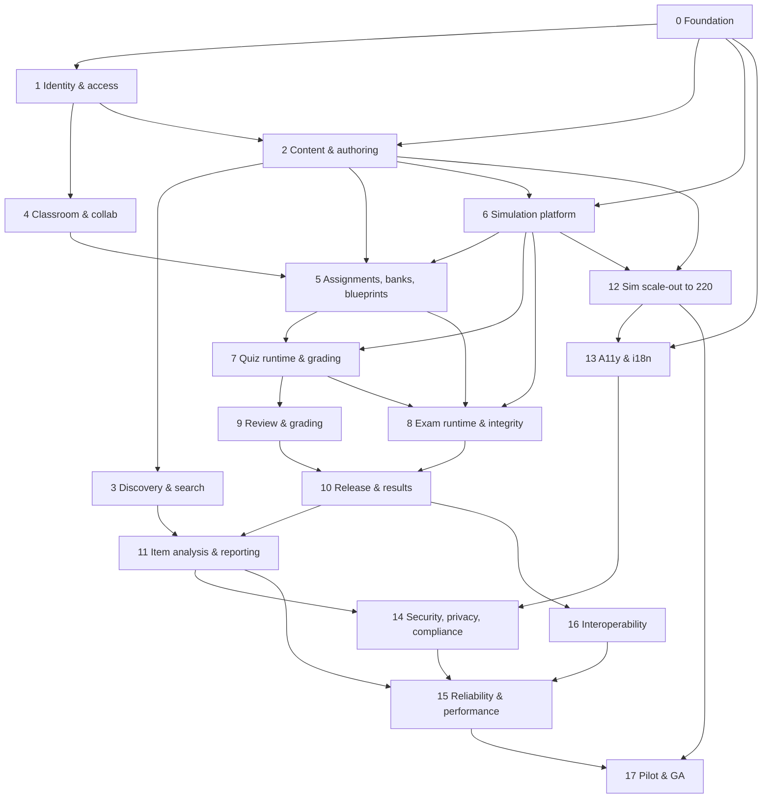

# 00 — Master Plan

> Product scope, stack, engineering standards, all 18 phases, risks, and the definition of done.
> Every other document in `plans/` is subordinate to this one.

---

## 1. Product

**Orrery** is an educational portal where anyone can register and create content, quizzes and exams; embed hundreds of interactive simulations; run classrooms; and grade submitted work.

Four coupled products:

| # | Product | Promise |
|---|---|---|
| 1 | **Studio** | Anyone authors resources — lessons, quizzes, exams — with a structured block editor, math typesetting, and embedded simulations. Versioned, pinnable, publishable. |
| 2 | **Simulations** | A sandboxed, versioned catalogue of 220+ interactive simulations across maths, physics, chemistry, biology, earth science, astronomy, computing and engineering. Embeddable in lessons **and** usable as auto-gradable exam questions. |
| 3 | **Classroom** | Teachers own classrooms, invite students, assign a **pinned** resource version. Rosters, roles, codes, CSV import. |
| 4 | **Assessment** | Quizzes auto-grade. Exams run under configurable integrity conditions (fullscreen, pointer lock, focus watchdog, per-question and total time, availability window, accommodations). **Every** response is submitted to the teacher for review; automatically graded items stay sealed until the teacher releases the whole batch. |

### 1.1 The four laws

Everything in this plan serves these. They are not aspirations; they are testable properties with `INV-*` identifiers and machine-checked tests.

1. **The server is the only authority.** Client clocks, client state and client scores are untrusted. Deadlines, grading and release are computed server-side. The exam client renders server truth; it never originates it.
2. **Content is immutable once assigned.** A `ResourceVersion` is write-once. An `Assignment` pins a version. Editing afterwards never changes what a student is assessed on. (`INV-CONTENT-1`, `INV-ASSIGN-1`)
3. **Withholding is atomic.** A student never sees a partially graded result — not in a payload, not in an error message, not inferable from timing or size. Enforced structurally, verified by a route audit. (`INV-RELEASE-1`, `INV-RELEASE-2`)
4. **Integrity controls are evidence, never verdict.** The server cannot be lied to about time or scores. Browser controls produce a human-readable timeline. No automated action ever harms a student. (`INV-TELEMETRY-1`, ADR-0017`)

---

## 2. What research changed

Evidence gathered before writing this plan is recorded with citations in `21-RESEARCH-NOTES.md`. Five findings changed the design materially:

| Finding | Consequence in this plan |
|---|---|
| **Proctoring has high specificity but catastrophically low sensitivity.** One controlled trial found automated detection caught **0 of 6** staged cheaters while human review caught 1; scores fell 10–20% after adoption. (`RN-01`) | Integrity output is *evidence for a human*. No auto-punishment, no auto-void. Strikes escalate to teacher attention only. `ADR-0017` |
| **Proctoring measurably harms performance and disproportionately harms some students.** Facial detection in particular is documented as disproportionately false-flagging students of colour, students with accommodations, and students on unstable connections. (`RN-02`) | **No biometric proctoring in v1, ever by default.** Accommodations mode is a first-class teacher-granted policy variant. Published integrity policy. Opt-out path. `09-EXAM-INTEGRITY.md` §8 |
| **The effective anti-cheat levers are item-level, not browser-level.** A meta-analysis of 49 studies / 100k+ test takers found the online-testing advantage collapses to near zero when you combine **strict time limits + non-searchable content + lockdown**, and that deep item pools / adaptive selection stop students sharing answers. (`RN-03`) | Question **banks, pools, blueprints, per-student variants and a deep item pool** are promoted from nice-to-have to core scope (`06-QUESTION-BANK-BLUEPRINT.md`). |
| **Established LMSes converge on specific, copyable mechanics.** Moodle: grace period (default 60 s), auto-submit on timeout, *no marks for answers entered after time ran out*, shuffle, sequential navigation, per-group/per-user overrides. Canvas: one-question-at-a-time with **Lock Questions**, question banks and pools, Moderate Quiz, and an **ungraded practice attempt** before a locked exam. (`RN-04`) | All of these are specified. Moodle's "no marks after time" is the direct precedent for our server-rejected late writes. The practice attempt becomes a first-class concept. |
| **Auto-grading validity is a real discipline, not a lookup table.** Difficulty is the p-value; discrimination ≥ 0.3 (point-biserial) is the conventional acceptance floor; the D/B indices are positively biased and need correction; **local item dependency** can manufacture spurious discrimination; multi-select partial credit has at least five named methods with different validity properties. (`RN-05`) | `08-ITEM-ANALYSIS.md` specifies formulas, correction, suppression rules and validity caveats. `07-ASSESSMENT-GRADING.md` §3 implements a named partial-credit taxonomy (NC/NG/SU/RI/PM) instead of an ad-hoc boolean. |

Two further engineering findings:

- **Prisma 8 is GA and Prisma 6+ rejects `undefined` in a `where` clause instead of silently ignoring it** (`RN-06`). For an autonomous build this is a feature: a whole class of "the filter just didn't apply" bugs becomes a type error. We pin Prisma 8 and lean into strictness.
- **H5P is the closest prior art to our simulation host, and its failure modes are instructive** (`RN-07`): fullscreen inside an iframe does not work without a bespoke `postMessage` protocol; putting an editor inside an iframe caused years of CSS breakage; and a decade-old `jQuery 1.9.1` dependency became a liability. We take the resize protocol, keep all editors **out** of iframes, and ship the SDK with zero runtime dependencies.

---

## 3. Scope

### 3.1 v1 (ships)

**Identity.** Email + password, magic link, email verification, Argon2id, database sessions (revocable), TOTP MFA (required for teachers before grading), account export, account deletion with anonymisation, minors posture.

**Authoring.** Block editor with 16 block types, KaTeX, media library, alt-text enforcement, draft autosave with optimistic concurrency, immutable version history, structural diff, restore, draft/published/archived, private/unlisted/public.

**Discovery.** Hierarchical subjects, tags, public library, Postgres full-text search with trigram fallback, facets, ratings, comments, flags, sitemaps.

**Classroom.** Create/archive/transfer, roles (owner/teacher/student), email invites, bulk invites, 6-character join codes, CSV roster import with dry-run, per-student display-name override, notifications.

**Assessment.** Question banks, pools, blueprints, per-student variants, 10 question types, 5 named partial-credit methods, simulation questions auto-graded server-side, rubrics, ungraded practice attempts, availability windows, attempts, shuffle, sequential/lock navigation.

**Exam integrity.** Preflight, fullscreen, pointer lock, focus/tab/visibility watchdog, copy/paste/print deterrence, per-question and total deadlines, grace period, server-authoritative time, single active session, multi-device detection, batched signed telemetry, escalation ladder, accommodations mode, tamper-evident submission receipt, deadline cron auto-submit.

**Grading & release.** Review queue, keyboard-first grading workspace, sim replay, rubrics, bulk actions, regrade, atomic release batches, per-question and per-attempt feedback, student results, pre-release "sealed" experience, late/missing/excused/void.

**Insight.** Gradebook, weighted totals, item analysis with validity caveats, integrity report, answer-similarity signals, CSV/PDF export, teacher dashboard, sim usage analytics.

**Simulations.** `sim-host@1` protocol, sandboxed host, JSON manifests, zero-dependency SDK, dual browser/grader targets, registry, conformance matrix, 24 gold sims, declarative Sim Studio, catalogue of 220.

**Platform.** Audit log, structured logging with a `redact()` helper, traces with an `attemptId` spine, SLOs and alerts, runbooks, PITR, tested restore, dependency scanning, secret scanning, WCAG 2.2 AA, i18n framework with two shipped locales, QTI 2.2/3.0 and xAPI 2.0 export, LTI 1.3 launch, OneRoster 1.2 roster sync.

### 3.2 Out of scope for v1, with the reason and the landing place

| Deferred | Why | Lands |
|---|---|---|
| Biometric / webcam proctoring | `RN-01`, `RN-02`: poor sensitivity, documented demographic bias, consent and legal burden | Never by default. A v2 opt-in module would need its own bias audit, per-institution consent, and a human review queue |
| Live human proctoring console | Operational cost, and we are not a video company | v2+, institution-managed |
| User-uploaded simulation code | Supply-chain and legal risk (`ADR-0018`) | Not planned. Sim Studio covers the long tail declaratively |
| Real-time collaborative editing | CRDTs would jeopardise P2 and are not needed for single-author authoring | v2, if demand appears |
| Payments / subscriptions | No requirement stated | Post-v1 |
| Offline exam taking | Conflicts with server-authoritative timing | v2, with a local-first outbox and explicit reconciliation |
| Native mobile apps | Exam conditions need a browser; responsive web is a hard requirement | Never |
| Machine-learning item generation | Needs an eval harness we do not have | v2, after `08-ITEM-ANALYSIS.md` exists to score the output |
| Full IRT / CAT | Overkill at our scale and our question counts | v2 "CAT-lite": stratified draw from pools, which captures most of the benefit |

---

## 4. Stack

Chosen for autonomous execution: strongly typed end to end, declarative schema, few novel tools, one-command local reproduction, one language.

| Layer | Choice | Version | Rejected | Why |
|---|---|---|---|---|
| Language | TypeScript `strict` | 5.9 | Python, Go | One contract language across app, grader, SDK, sims |
| Runtime | Node | 24 LTS | — | LTS, native TS, native test runner |
| Package manager | pnpm | 10 | npm, yarn | Strict, fast, workspace-native |
| Task graph | Turborepo | 2 | Nx, none | Minimal config, correct ordering, cached |
| Lint/format | **Biome** + `eslint` only where a rule does not exist | 2.x | ESLint + Prettier | Biome is one fast tool for lint *and* format; ESLint is a known-risky dependency in 2026 (`RN-08`). We keep ESLint solely for the import-boundary rules Biome cannot express, and pin it |
| Web | Next.js App Router, React 19, RSC | 15 LTS (16 evaluated at P0) | Remix, Vite SPA + API | SSR for the library, client islands for exam/editor, one deployable. `RN-09` |
| API | tRPC v11 (superjson) + **frozen REST** for exam-critical paths | — | REST-only, GraphQL | Types where types help; dumb and explicit where a deadline is running |
| DB | PostgreSQL | 16 | MySQL, SQLite | JSONB, constraints, CTEs, `tstzrange`, transactional release |
| ORM | Prisma | **8.x GA** | Drizzle, raw SQL | Declarative schema + checked-in SQL migrations. Prisma 6+ errors on `undefined` filters, which removes a bug class (`RN-06`) |
| Auth | Better Auth, DB sessions, Argon2id | latest stable | JWT-only, Clerk, hand-rolled | Revocable sessions are a hard requirement for mid-exam removal |
| UI | Tailwind CSS 4 + shadcn/ui (owned in `packages/ui`) | 4 | Mantine, Chakra | We own the components, so exam-critical a11y is ours to guarantee |
| Editor | TipTap v3 / ProseMirror JSON | 3 | MDX, Lexical, raw HTML | Structured, sanitising, no author-supplied JSX |
| Math | KaTeX (`trust: false`, `strict: 'error'`, MathML out) | latest | MathJax | Sync, SSR-safe, no author macros |
| Simulations | esbuild ESM bundles, `sandbox="allow-scripts"` iframe on a **separate origin**, `postMessage` RPC `sim-host@1`, **dual browser/grader targets** | — | React components, WASM-only, Web Components | Isolation (`INV-SIM-1`) and server-gradability (`INV-SIM-2`) |
| Jobs | Inngest + Postgres cron | latest | BullMQ, Temporal | Retries and step history at low operational cost |
| Storage | S3-compatible (MinIO local), presigned PUT, content-addressed sim bundles | — | Disk | No server disk state; sim bundles are immutable |
| Cache / rate limit | Redis | 7 | in-process | Correct limits across replicas |
| Email | Resend | — | SES, Postmark | Simple, good defaults, easy local substitute (Mailpit) |
| Tests | Vitest + Playwright + Testcontainers + fast-check | latest | Jest, Cypress | One toolchain; Playwright drives both E2E and the sim conformance matrix |
| Observability | OpenTelemetry → Tempo + Prometheus/Grafana; Sentry; Pino | latest | — | The `attemptId` spine (`18-OPS-RELIABILITY.md`) |
| CI | GitHub Actions | — | — | Native to the worktree protocol |
| Deploy | OCI containers; managed Postgres, Redis, S3 | — | Vercel-only | We need the sim build pipeline and, critically, a **separate sim origin** (`ADR-0011`, `ADR-0014`) |

### 4.1 Version pinning policy
Dependencies are pinned exactly in the lockfile and updated by a dedicated, reviewed task — never as a drive-by. `@orrery/contracts`, `grading`, `exam-engine`, `sim-sdk` pin to the current minor and absorb no new majors within a phase. Node, pnpm and Prisma versions are asserted in CI so a contributor cannot silently drift them.

### 4.2 Scale assumptions used for sizing
- 50,000 registered users; 1,000 peak concurrent web; **750 peak concurrent exam takers**.
- 20,000 resources; 220 registered simulations; 25,000 sim invocations/day.
- Exam writes: 750 × 0.2/s ≈ 150 writes/s steady; a deadline stampede is designed for 400/s with shedding.
- One assignment may reach 5,000 submissions released in a single batch.

---

## 5. Repository

```
orrery/
├─ apps/
│  ├─ web/                 # Next.js: marketing, library, studio, classroom, learn, exam, grading
│  └─ worker/              # Inngest consumer + cron. No HTTP handlers.
├─ packages/
│  ├─ contracts/           # Zod: blocks, questions, policies, sim manifests, DTOs, events
│  ├─ db/                  # the ONLY place Prisma is imported; named query fns, no client export
│  ├─ sim-sdk/             # zero-dependency author SDK: types, bridge, graders, harness
│  ├─ sim-host/            # iframe runtime + protocol host component
│  ├─ grading/             # pure grading engine, partial credit, rubrics, receipt hashing
│  ├─ exam-engine/         # policy eval, deadline math, violations, escalation (isomorphic)
│  ├─ analytics/           # item analysis formulas, similarity, rollups (pure + SQL modules)
│  ├─ auth/                # Better Auth server, sessions, the `can()` kernel
│  ├─ ui/                  # design system, block renderers, editor extensions
│  ├─ interop/             # QTI, xAPI, LTI 1.3, OneRoster codecs
│  └─ config/              # tsconfig bases, biome, eslint boundary rules, env schema
├─ sims/                   # one folder per simulation
│  ├─ _template/
│  └─ <subject>.<slug>/    # manifest, spec card, src, test, LICENCE
├─ e2e/                    # Playwright: app golden paths + sim conformance matrix
├─ infra/                  # compose, Dockerfiles, terraform, migration runner
├─ scripts/                # sim:new, sim:validate, seed, reset:e2e, scan-secrets, load
├─ docs/                   # SUPERSEDED earlier draft, kept for history
└─ plans/                  # this plan set
```

**Boundaries, enforced by tooling not convention:**
- App code never imports from `sims/`. Simulations only ever see `@orrery/sim-sdk` and `sim-host@1`.
- No package imports `next`. A package that needs a framework does not belong in `packages/`.
- Only `packages/db` imports Prisma, and it exports functions — never a client instance.
- No barrel files. (`RN-09` — barrel files are the main cause of bundle bloat and server/client boundary bugs in App Router projects.)
- `@orrery/contracts` imports nothing but Zod. It is the bottom of the graph.

---

## 6. Engineering standards

### 6.1 Quality gates — every task passes all of these

```
pnpm lint           # biome check + eslint boundary rules
pnpm typecheck      # tsc --noEmit, all packages, no emit
pnpm test           # vitest unit + integration (Testcontainers PG/Redis)
pnpm test:e2e       # playwright, seeded local stack
pnpm audit:deps     # osv-scanner; high/critical fails
```
Domain gates activate as their phase lands: `sim:validate`, `sim:conformance`, `a11y`, `audit:seals`, `audit:payloads`, `i18n:check`, `test:load`.

### 6.2 Hard rules

1. **Time only through `@orrery/clock`.** No `Date.now()`, `new Date()` for logic, or `performance.now()` outside that module. Enforced by `no-restricted-imports` + `no-restricted-syntax`. A `FrozenClock` makes the entire time model testable, which the exam phase depends on.
2. **Randomness only through `@orrery/rng`** (seeded, persisted per attempt). No `Math.random()`.
3. **Authorisation only through `can()`.** No ad-hoc ownership checks. Default deny.
4. **Answer keys never leave the server.** One `publicQuestionSpec()` function, exhaustively typed so a new question type fails compilation until it is handled.
5. **No `any`.** `unknown` and narrow at boundaries.
6. **No `TODO`, `FIXME`, `@ts-ignore`, `@ts-expect-error` (without a comment explaining why), or commented-out code** in merged code. Each is a follow-up task or nothing.
7. **Migrations ship with the code that needs them**, forward-only in production, with a documented reversal for local dev.
8. **Every consequential mutation writes an audit event in the same transaction.**
9. **Never weaken a gate to pass it.** No skipped tests, no `.only`, no lowered thresholds, no deleted assertions. If a gate is wrong, changing it is its own reviewed task with a rationale.

### 6.3 Coverage policy

| Package | Floor | Why |
|---|---|---|
| `@orrery/grading` | **100% branch** | Decides grades. An uncovered branch is a mis-graded student. |
| `@orrery/exam-engine` | **100% branch** | Decides deadlines and escalation. |
| `@orrery/analytics` | **100% branch** | Reports statistics about students to their teachers. |
| `@orrery/contracts` | 100% statement | The validators are a security boundary. |
| `@orrery/auth` (`can()`) | **100% branch** | The authorisation matrix. |
| `@orrery/sim-sdk` | 95% | Also covered by per-sim conformance tests. |
| everything else | 85% lines | — |

### 6.4 Golden E2E paths (the milestone gate)
1. Register → author a resource using all 16 block types with 2 simulations and 3 equations → publish → read as a stranger.
2. Pin: assign v1 → edit to v2 → student is still assessed on v1.
3. Classroom: invite by email → student registers → accepts → appears in the roster.
4. Join by code → revoke → join fails.
5. Quiz: 30 mixed questions incl. 2 simulation questions → autosave → hard refresh → resume → submit.
6. **Withholding:** no score reachable pre-release by UI, API, direct fetch, headers, or payload diffing.
7. Release: review free responses → release the batch → all students see results atomically.
8. Exam happy path under full policy → submit → receipt verifies.
9. Exam violation path: fullscreen exit, tab switch, copy → events recorded → escalation visible → teacher timeline correct.
10. Exam deadline expiry → cron auto-submits the correct server-held state.
11. Offline resilience: kill the network mid-exam → queue → restore → no acknowledged save lost.
12. Accommodations: extra time granted, tab switches not counted as violations.

---

## 7. Phase graph



**Critical path:** `P0 → P1 → P2 → P6 → P8 → P10 → P14 → P15 → P17`.
`P6` (simulation platform) is on the critical path, which is why it lands early and gets the largest early investment. `P12` (scale-out) is embarrassingly parallel and is the schedule shock absorber — it must start no later than P9.

### 7.1 Phase index

| Phase | Name | Size | Ideal agent-hrs | Depends | Gate |
|---|---|---|---|---|---|
| P0 | Foundation & decisions | M | 24 | — | `pnpm setup && pnpm dev` boots everything; CI green; ADRs accepted |
| P1 | Identity, sessions & the `can()` kernel | M | 28 | P0 | Register → verify → session → revoke → delete |
| P2 | Content model, block schema & editor | L | 64 | P0,P1 | All 16 block types authored, rendered, versioned, diffed, published |
| P3 | Subjects, library, search & moderation | M | 30 | P2 | Browse, search, filter, rate, flag |
| P4 | Classrooms, membership, invites, notifications | L | 46 | P1 | Email invite, code join, roles enforced, 1,000-row CSV |
| P5 | Assignments, version pinning, question banks, blueprints | L | 56 | P2,P4,P6 | Pin invariant proven; draw 3-of-12 from a pool; blueprint coverage check |
| P6 | Simulation platform + 24 gold sims | XL | 92 | P0 | Sim sandboxed, graded server-side, conformance suite green |
| P7 | Quiz runtime, question types & auto-grading | L | 72 | P2,P5,P6 | Full quiz loop, all 5 partial-credit methods, held grades |
| P8 | Exam runtime & integrity | XL | 108 | P5,P6,P7 | Clock-authoritative; violations evidence-only; accommodations |
| P9 | Teacher review & grading workspace | L | 64 | P7 | Queue, keyboard grading, sim replay, regrade |
| P10 | Atomic release & student results | M | 46 | P8,P9 | Route leak audit green; atomicity proven under load |
| P11 | Item analysis, gradebook & integrity reporting | L | 58 | P3,P10 | Hand-computed fixtures match; LID caveat surfaced |
| P12 | Simulation scale-out to 220 | XL | 132 (parallel) | P6,P2 | Registry ≥ 200, conformance 100% green |
| P13 | Accessibility (WCAG 2.2 AA) & i18n | L | 60 | P2,P12 | Audit signed off; 3 locales; accommodations proven |
| P14 | Security, privacy & compliance | L | 60 | P10,P11,P13 | Threat model reviewed; DSAR rehearsed; zero high/crit |
| P15 | Reliability, performance, load & DR | L | 72 | P11,P14,P16 | 750 concurrent takers; restore drill timed; SLOs alerting |
| P16 | Interoperability: QTI, xAPI, LTI 1.3, OneRoster | L | 56 | P10 | Round-trip import/export; LTI launch conformance |
| P17 | Pilot, seed content, docs & GA | L | 64 | P12,P15 | Pilot cohort completes a proctored exam with zero data loss |
| | **Total** | | **~1,136** | | |

With 4–6 parallel agent lanes: **7–10 weeks wall clock** to GA, including integration overhead.

---

## 8. Cross-cutting requirements

| Requirement | Rule | Verified by |
|---|---|---|
| **Time** | Only `@orrery/clock`. Server authoritative everywhere. | ESLint restriction + `FrozenClock` tests |
| **Randomness** | Only seeded `@orrery/rng`; seed stored on the attempt. | ESLint restriction + determinism tests |
| **Authorisation** | Every read and write passes `can()`. Default deny. | `can()` matrix at 100% branch + route tests |
| **Answer secrecy** | Keys server-side only; one public projection; nothing in payloads, HTML, errors, logs, traces or analytics. | `audit:seals` + `audit:payloads` in CI |
| **Auditability** | Grading, release, policy change, membership change, impersonation, deletion → immutable audit events. | Audit coverage test |
| **Telemetry hygiene** | Closed payload schemas, allowlisted keys, no content, no PII, no keystrokes, no clipboard, no camera. | Log-scrubbing test with canary values |
| **Accessibility** | WCAG 2.2 AA. Accommodations mode is a first-class requirement. | axe in CI + manual audit (`15-A11Y-I18N.md`) |
| **Privacy** | Minimal collection, retention schedules, DSAR, minors posture, published integrity policy. | P14 gates |
| **Sim safety** | Untrusted code: isolated origin, no `allow-same-origin`, nonce messaging, strict CSP, no network/storage. | Sandbox escape test in CI |
| **Graceful degradation** | A sim failure never loses an answer; every embed has a static fallback. | Fault injection |
| **Observability** | `requestId` everywhere; `attemptId` spine across web + worker. | Trace assertion test |
| **Localisation** | No hardcoded strings; RTL-ready; locale-correct dates/numbers. | `i18n:check` |
| **Docs** | Non-obvious decisions become ADRs; user-facing features get docs before GA. | PR checklist |

---

## 9. Milestones

| Milestone | Phases | Demonstrable outcome |
|---|---|---|
| **M0 Foundations** | P0 | Stack boots from one command; CI green; ADRs accepted |
| **M1 Author** | P1, P2, P3 | Register and publish a rich, versioned, simulation-bearing resource |
| **M2 Teach** | P4, P5 | Classroom, invites, pinned assignment, question pools, blueprint |
| **M3 Simulate** | P6 | 24 sims embedded; a simulation question auto-graded on the server |
| **M4 Quiz** | P7 | Full quiz loop, all partial-credit methods, grades sealed |
| **M5 Exam** | P8 | Proctored exam, server-authoritative clock, evidence-only violations |
| **M6 Grade** | P9, P10 | Teacher reviews, releases atomically, students see results |
| **M7 Insight** | P11 | Gradebook, item analysis with validity caveats, integrity report |
| **M8 Catalogue** | P12, P13 | 220 sims conformant; WCAG 2.2 AA; 3 locales |
| **M9 Interoperate** | P16 | QTI/xAPI round-trip; LTI 1.3 launch; OneRoster sync |
| **M10 Ship** | P14, P15, P17 | Pilot cohort, load proven, restore drilled, GA checklist signed |

---

## 10. Risk register

| # | Risk | L | I | Mitigation | Phase |
|---|---|---|---|---|---|
| R1 | Integrity controls are theatre; students bypass them and teachers lose trust | H | H | Treat as evidence for a human, never as a verdict. Publish what we can and cannot detect. Put real effort into server authority, item pools and variants. `ADR-0017` | P8 |
| R2 | Proctoring harms legitimate students (anxiety, accommodations, bias) | M | H | No biometrics in v1. Accommodations mode. Opt-out. Published policy. Score-delta monitoring after adoption. `RN-01`, `RN-02` | P8, P13 |
| R3 | Item banks are too shallow to make variants meaningful | M | H | Blueprint tooling, per-subject minimum bank sizes, and an authoring-time coverage report so a teacher cannot publish a pool they cannot draw from. `06` | P5 |
| R4 | Auto-grading is wrong and a student is mis-graded | M | H | `@orrery/grading` pure and 100% branch covered; named partial-credit methods; hand-computed fixtures reviewed by a second person; grader version stored per response; regrade is audited | P7, P9 |
| R5 | Item analysis produces confident nonsense | M | H | Suppression rules at small N; corrected indices; the local-item-dependency caveat surfaced in the UI; difficulty and discrimination framed as prompts for teacher judgement, never as verdicts about a student. `08` | P11 |
| R6 | Deadline stampede overwhelms the database | M | H | Jittered autosave, forced pre-deadline submit, write shedding, deadline-bucketed cron, load-tested at 750. `RN-04` | P8, P15 |
| R7 | A partial release leaks | L | **C** | Single transaction + machine-checked route audit as a release gate. `INV-RELEASE-1/2` | P10 |
| R8 | Sim sandbox escape | M | **C** | Separate origin, no `allow-same-origin`, nonce messaging, strict CSP, escape test in CI, no user code. `ADR-0011`, `ADR-0018` | P6, P14 |
| R9 | 220 sims become unmaintainable drift | H | M | Machine-enforced conformance matrix as a release gate; spec card; 3-point review rubric; registry health blocks the build | P12 |
| R10 | Agent drift over a long multi-phase build | H | H | Stable task IDs, per-task worktrees, machine gates, phase packets generated from `20-PHASE-PACKETS.md`, and a board that only moves on green gates | all |
| R11 | Editor complexity stalls all content work | M | M | Block schema is renderer-agnostic; a plain block-list authoring UI is a sanctioned fallback | P2 |
| R12 | Email deliverability blocks classroom onboarding | M | M | Mailpit locally, code-based join as an equal path, resend cooldowns, digest batching | P4 |
| R13 | Retention/DSAR never implemented because it is boring | H | H | Retention jobs and DSAR written in the phase that creates the data | P14 |
| R14 | QTI/LTI scope consumes the last quarter | M | M | Export-only first; launch before full parity; a documented subset beats a stalled standard. `16` | P16 |
| R15 | This plan is wrong somewhere | H | M | P0-T9 exists specifically to find the top risks in this plan and resolve them before P1 | P0 |

---

## 11. Decisions taken, with defaults

Recorded so execution is not blocked. All are reversible; all are written up in `22-ADRS.md`.

| # | Question | Decision taken | Reversible |
|---|---|---|---|
| D1 | Market | All three (schools, university, self-learners). Pilot is one secondary-school classroom. Content and policy are configuration, not code. | Yes |
| D2 | Hosting | Hosted SaaS, single-tenant-ready schema from day one (`tenantId` reserved on every table) | Yes |
| D3 | Compliance | GDPR-shaped defaults: consent versioning, DSAR, EU data region, no third-party analytics, minors posture | Partly |
| D4 | Managed school devices | A hard requirement. No extensions, no WebGPU requirement, no install prompt. Capability preflight that **degrades with disclosure**, never dead-ends | Yes |
| D5 | User-uploaded sims | No. Sim Studio is declarative only. `ADR-0018` | Yes |
| D6 | Auto-release without a teacher | No for exams (`MANUAL` only). Quizzes may opt into `AUTO_RELEASE`. | Yes |
| D7 | Student identity | User-chosen display name, with a per-classroom teacher override. No real-name requirement. | Yes |
| D8 | Languages | English (en-GB) primary, en-US and one further locale to prove the framework. RTL layout-checked. | Yes |
| D9 | Simulation count | 220 planned; **200 is the GA gate**. | Yes |
| D10 | Custom lockdown client | No. Mitigation is server authority, item variation, evidence, and human review. `RN-01` | Yes |
| D11 | Biometric proctoring | Out of v1 entirely. Not "off by default" — absent. `RN-02` | Hard, and that is deliberate |
| D12 | Grading transparency | Students may see *which* questions were auto-graded and how, after release — never before. | Yes |
| D13 | Item analysis use | Diagnostics for teachers improving their questions. Never used to rank, stream or sanction students. | Policy, not code |

---

## 12. Definition of Done

A **task** is done when all twelve hold:

1. Implementation complete; no `TODO`, `FIXME`, `@ts-ignore`, commented-out code.
2. `pnpm lint && pnpm typecheck && pnpm test && pnpm test:e2e && pnpm audit:deps` all pass.
3. Tests cover the happy path, the failure path, and the boundary — including at least one test that would catch the specific bug this task is most likely to have.
4. Authorisation checked on every new read and write; a test proves a non-privileged user, a cross-classroom user, and an anonymous caller are all refused.
5. No answer key, PII or credential in any client payload, log, trace, error or analytics event.
6. No bare `Date.now()` or `Math.random()`; clock and RNG injected.
7. Migrations included, reversible locally, safe on a populated database.
8. Audit events emitted for anything a teacher or admin would later need to explain.
9. Keyboard accessible and screen-reader labelled if it has an interaction; contrast checked; WCAG 2.2 new criteria considered (`15-A11Y-I18N.md`).
10. Documentation or ADR updated if a decision was made.
11. PR description states what changed, how it was verified (real pasted output), and what is explicitly **not** covered.
12. Commits carry `Task: <task-id>`; PR opened and linked on the board.

A **phase** is done when every task in it is done, its exit criteria are demonstrated in a recorded run, and the milestone demo is signed off.

A **plan** is done when a pilot cohort completes a proctored exam with zero data loss and every P0–P16 exit criterion has a linked, re-runnable verification command.
